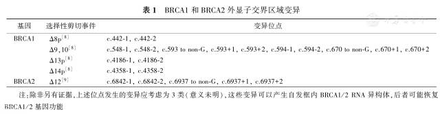
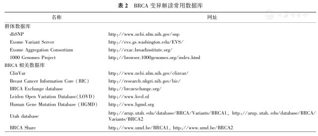
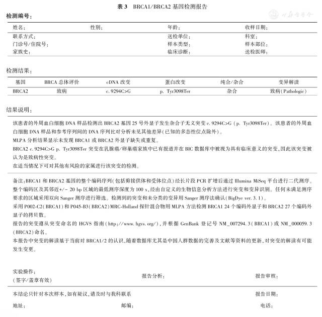

# breast cancer

## 《BRCA数据解读中国专家共识》

* 乳腺癌易感基因（breast cancer susceptibility gene, BRCA）是重要的抑癌基因与肿瘤易感基因，包括BRCA1及BRCA2。BRCA在DNA修复的同源性重组（homologous recombination）机制中扮演重要角色，BRCA基因突变会导致基因组不稳定性显著增加。胚系BRCA1/2突变（gBRCAm）将显著提高女性乳腺癌、卵巢癌以及其他癌症的发病风险。近年来的研究发现，在一小部分无胚系BRCA基因突变患者的乳腺癌或卵巢癌肿瘤组织中也可以检测到BRCA基因体细胞突变（sBRCAm）。BRCA基因也是与精准治疗密切相关的生物标志物，具有BRCA1/2突变的卵巢癌患者对铂类化疗非常敏感，预后良好，并可获益于聚二磷酸腺苷核糖聚合酶（poly ADP-ribose polymerase，PARP）抑制剂的治疗[1]。随着精准医学和靶向治疗的进展，对相关肿瘤患者血液和/或肿瘤组织进行BRCA突变检测将有助于更好地判断预后、选择靶向药物、选择化疗方案、在适当的条件下对家族遗传史患者亲属的患病风险进行评估，帮助医师根据患者的基因状态来选取更精准的治疗方案。
* BRCA1/2基因序列较长，变异形式多样，变异位点分散遍布于2个基因的全长[2]，并且不是所有的BRCA变异都会损伤蛋白质功能，因而，变异的解读是BRCA检测中一个关键的环节。BRCA基因变异解读需要依据各类信息（包括来自群体数据库、疾病数据库、文献和患者病史的信息）进行综合评判。近年来国外多个权威机构先后发布了BRCA基因变异数据解读的标准或指南。目前，我国在BRCA基因变异数据解读领域尚缺乏规范性指导。因此，中华医学会病理学分会特组织分子病理学领域的相关专家进行了充分讨论，并形成共识发布，以指导与规范我国BRCA基因检测数据的解读，推动BRCA检测在我国的临床应用。
* 一、BRCA变异类型、检测区域及检测方法
    
    BRCA变异类型主要包括点突变、小片段插入/缺失和大片段重排（large rearrangement）等。除BRCA基因编码区的变异外，内含子发生的一些变异亦可能会通过干扰RNA剪切等方式影响蛋白质功能，因此BRCA检测必须同时覆盖编码区和相邻边界区（以±20 bp为佳）。

    Sanger测序是检测BRCA基因点突变和小片段插入缺失的传统技术，也可以作为其他检测方法的补充或结果验证手段。多重连接依赖性探针扩增（multiplex ligation-dependent probe amplification assay，MLPA）、定量聚合酶链反应（quantitative polymerase chain reaction，qPCR）和长片段聚合酶链反应（long range PCR，L-PCR）是目前用于检测BRCA基因大片段重排的三个主要技术平台。

    近年来，随着二代测序（next generation sequencing，NGS）技术的飞速发展，国内外越来越多的实验室已将NGS技术应用于BRCA基因变异的临床检测。除应用于点突变和小片段插入缺失的检测外，在测序策略和生物信息学工具方面有着特殊设计的NGS也可用于大片段重排的检测。

* 二、BRCA基因变异命名规则
    
    推荐使用人类基因组变异协会（Human Genome Variation Society, HGVS）命名法作为基因变异命名的主要指导原则以规范基因序列变异的命名。同时参考序列必须包含在内以确保基因变异命名的准确无误。HGVS命名法的首选DNA编码参考序列是基因座参考基因组序列（Locus Reference Genomic sequence, LRG www.lrg-sequence.org ），但LRG尚未被广泛应用在解读的数据库和文献里。因此根据目前的情况，推荐使用最常用的2个转录本序列，分别为NM_007294.3（BRCA1）和@@NM_000059.3（BRCA2），相应的蛋白质参考序列为NP_009225.1（BRCA1）和@@NP_000050.2（BRCA2）。同时推荐使用命名工具 https://mutalyzer.nl/ 对基因变异的HGVS命名进行校验。

* 三、BRCA变异分类

    根据国际癌症研究机构（International Agency for Research on Cancer, IARC）[3]、美国医学遗传学与基因组学学会（American College of Medical Genetics and Genomics, ACMG）[4,5]和胚系突变等位基因解读实证联盟（Evidence-based Network for the Interpretation of Germline Mutant Alleles, ENIGMA，enigmaconsortium.org）[6]的分类系统，将BRCA基因变异按照风险程度由高至低分为以下5类：致病性（5类，致病可能性\>0.99）、可能致病性（4类，致病可能性在0.95～0.99之间）、意义未明（3类，致病可能性在0.05～0.949之间）、可能良性（2类，致病可能性在0.001～0.049之间）和良性（1类，致病可能性&lt;0.001）。受试者的总体BRCA状况应为其所有BRCA1/2基因变异中风险程度最高的类别。

* 四、BRCA变异解读
    
    目前，BRCA变异解读最权威的指南或标准包括：ACMG和美国分子病理学会（Association forMolecular Pathology，AMP）序列变异解读标准和指南（2015版）[4]，欧洲分子基因诊断质量联盟（European Molecular Genetics Quality Network，EMQN）遗传性乳腺癌/卵巢癌分子遗传分析最佳实践指南（2008版）[7]和ENIGMA BRCA1/2基因变异分类标准（1.1版）[6]。

    ACMG于2000年发布了第1版变异解读总体指南，并于2007年进行了修订，2015年ACMG和AMP联合发布了该变异解读指南的最新版本。EMQN是一家为全球实验室提供室间质量评估（external quality assessment）服务的非营利性机构，致力于提高临床分子遗传学检测质量。1999年EMQN起草了第1版遗传性乳腺癌/卵巢癌分子遗传分析最佳实践指南，并于2007年EMQN研讨会讨论，后在2008年更新了该指南。ENIGMA是一个国际研究者联盟，致力于确定BRCA1、BRCA2和其他已知或可疑乳腺癌基因序列变异的临床意义。基于已发表的指南（包括ACMG 2007版）和各成员制定的分类标准，ENIGMA于2015年发布了专门针对BRCA1/2的变异分类标准。在其标准里，ENIGMA根据已知的对功能域的认知，总结了BRCA1/2的功能域以及可能恢复BRCA1/2基因功能的自然存在的框内RNA异构体（naturally occurring in-frame RNA isoforms；表1）。除此之外，ENIGMA还发表了一些针对临床意义未明变异的研究。这些都是变异解读非常有用的资源。同一变异依据不同的解读指南或标准所得到的解读结果可能会略有差异，因而我们建议在变异解读时具体指明所依据的指南或标准名称。

    
    
    表1 BRCA1和BRCA2外显子交界区域变异

    综合以上指南解读规则以及BRCA基因的特征，我们总结出以下解读规则：

　　1.致病性（pathogenic）-5类。包括以下几种情况：（1）编码提前终止密码子的序列变异，即BRCA1第1 855位氨基酸和BRCA2第3 309位氨基酸前发生的无义突变或移码突变。（2）发生在剪切位点即外显子上下游第一或第二个碱基的变异，但是，需除外经预测或已明确的可产生可能恢复BRCA1/2基因功能的自然存在的框内RNA异构体的变异（表1）。（3）拷贝数缺失变异，该变异导致BRCA1第1 855位氨基酸和BRCA2第3 309位氨基酸前发生移码突变，或者该变异移除1个或多个外显子且不是经预测或已明确的可产生可能恢复BRCA1/2基因功能的自发框内RNA异构体的变异。（4）任意大小的拷贝数重复变异，该变异导致1个或多个外显子重复并已被证实会导致BRCA1第1 855位氨基酸和BRCA2第3 309位氨基酸前发生移码突变。（5）体外或体内功能研究显示对基因或基因产物有破坏作用且与肿瘤高危相关的其他类型变异。

　　2.可能致病性（likely pathogenic）-4类。包括以下几种情况：（1）该变异经mRNA水平的实验证实能够改变剪接，但是不会产生可能恢复基因功能的自然存在的框内RNA异构体。（2）该变异编码的氨基酸改变与之前定义的5类致病性错义突变相同，但发生改变的基础核苷酸不同，而且既往疾病关联并非由剪接事件所致，并且变异未见于作为对照的外显子组测序项目（Exome Sequencing Project）、千人基因组计划（1000 Genomes Project）或外显子组整合数据库（Exome Aggregation Consortium），或变异位于已确认的功能区。（3）移除密码子的小片段框内缺失变异，该变异涉及的氨基酸位点已被证实可发生错义替换5类变异，且既往疾病关联并非由于剪接事件所致，并且变异未见于作为对照的外显子组测序项目、千人基因组计划或外显子组整合数据库，或变异位于已确认的功能区。（4）体外或体内功能性研究显示对基因或基因产物有破坏作用的其他类型变异，并且变异未见于作为对照的外显子组测序项目、千人基因组计划或外显子组整合数据库，或者变异位于已确认的功能区。

　　3.意义未明（uncertain significance）-3类：证据不足以将其归类为1、2、4或5类的变异，或证据与良性和致病性分类相矛盾的变异。

　　4.可能良性（likely benign）-2类。包括以下几种情况：（1）该变异编码的氨基酸改变与已确认的1类良性变异相同，但发生改变的基础核苷酸不同，且无证据表明该变异会导致剪接事件。（2）个体发生的胚系变异与已知致病变异在同一基因上呈反式（in trans）排列，且该个体除了BRCA相关肿瘤外无明显其他临床表征。

　　5.良性（benign）-1类：（1）外显子组测序项目、千人基因组计划或外显子组整合数据库中等位基因频率>5%的变异。（2）体外或体内功能研究显示对蛋白质功能或剪接无破坏作用的变异。

* 五、BRCA变异解读数据库
    
    变异解读的关键步骤之一是收集证据，并基于这些证据对变异进行分类。数据库是挖掘这些证据的重要资源。表2列出了一些常用的数据库，依使用情况分为2类：群体数据库和BRCA相关数据库。群体数据库记录的是以种群为基础的研究中发现的变异。大群体中的变异频率可从此类数据库中获取。BRCA1/2变异相关研究已开展多年，有一些专门收集BRCA变异的数据库和积累大量BRCA变异的疾病数据库，可从中找到变异解读和相应的支持证据。
    
    
    
    表2 BRCA变异解读常用数据库

* 六、BRCA检测报告

    一份完整的BRCA检测报告要能够被肿瘤科医师或其他非分子病理学专业的医师理解，报告内容应至少包括以下部分：样本信息、检测结果、基因变异分类的详细解释、检测方法和覆盖区域、签名和联系信息。样本信息部分应包括患者基本信息、样本类型、临床诊断、家族史。若送检的是肿瘤组织，样本信息部分还应该包括病理诊断、肿瘤细胞含量、取材时间、样本处理方式等信息[10]。检测结果部分应列出在该被检测者中发现的所有2～5类基因变异和总体BRCA状态。基因变异分类的详细解释部分应提供基因变异分类证据的简要说明。检测方法和覆盖区域部分应明确描述使用的是何种BRCA检测方法以及该方法覆盖的指定序列区域。签名和联系信息部分应列出实验操作、数据分析与报告撰写、报告复核的人员姓名及便于进一步问询的联系信息。数据分析人员应具有临床医学、分子生物学或遗传学知识背景并经生物信息学培训。最终报告应由中级或硕士以上具有相关背景、经培训合格的本单位执业医师或者授权签字人（高级职称或医学博士学位）审核。检测报告模板如表3。
    
    
    
    表3 BRCA1/BRCA2基因检测报告

* 参考文献

    　　[1]ScottCL, SwisherEM, KaufmannSH. Poly （ADP-ribose） polymerase inhibitors: recent advances and future development[J]. J Clin Oncol, 2015，33（12）：1397-1406. DOI: 10.1200/JCO.2014.58.8848.

    　　[2]FackenthalJD, OlopadeOI. Breast cancer risk associated with BRCA1 and BRCA2 in diverse populations[J]. Nat Rev Cancer, 2007，7（12）：937-948. DOI: 10.1038/nrc2054.

    　　[3]PlonSE, EcclesDM, EastonD, et al. Sequence variant classification and reporting: recommendations for improving the interpretation of cancer susceptibility genetic test results[J]. Hum Mutat, 2008，29（11）：1282-1291. DOI: 10.1002/humu.20880.

    　　[4]RichardsS, AzizN, BaleS, et al. Standards and guidelines for the interpretation of sequence variants: a joint consensus recommendation of the American College of Medical Genetics and Genomics and the Association for Molecular Pathology[J]. Genet Med, 2015，17（5）：405-424. DOI: 10.1038/gim.2015.30.

    　　[5]RichardsCS, BaleS, BellissimoDB, et al. ACMG recommendations for standards for interpretation and reporting of sequence variations: revisions 2007[J]. Genet Med, 2008，10（4）：294-300. DOI：10.1097/GIM.0b013e31816b5cae.

    　　[6]ENIGMA Consortium. ENIGMA BRCA1/2 gene variant classification criteria[EB-OL].（2015-03-26）[2016-08-10].https://enigmaconsortium.org/wp-content/uploads/2016/06/ENIGMA_Rules_2015-03-26.pdf.

    　　[7]LarssonN, Borg?, HodgsonS, et al. EMQN best practice guidelines for molecular genetic analysis in hereditary breast/ovarian cancer[EB-OL].（2007-10-25）[2016-09-25].https://www.emqn.org/emqn/digitalAssets/0/232_EMQNBRCAguidelines0908.pdf.

    　　[8]ColomboM, BlokMJ, WhileyP, et al. Comprehensive annotation of splice junctions supports pervasive alternative splicing at the BRCA1 locus: a report from the ENIGMA consortium[J]. Hum Mol Genet, 2014，23（14）：3666-3680. DOI: 10.1093/hmg/ddu075.

    　　[9]LiL, BiswasK, HabibLA, et al.Functional redundancy of exon 12 of BRCA2 revealed by a comprehensive analysis of the c.6853A>G （p.I2285V） variant[J]. Hum Mutat, 2009，30（11）：1543-1550.DOI: 10.1002/humu.21101.

    　　[10]《临床分子病理实验室二代基因测序检测专家共识》编写组。 临床分子病理实验室二代基因测序检测专家共识[J]. 中华病理学杂志，2017，46（3）：145-148. DOI：10.3760/cma.j.issn.0529-5807.2017.03.001.

